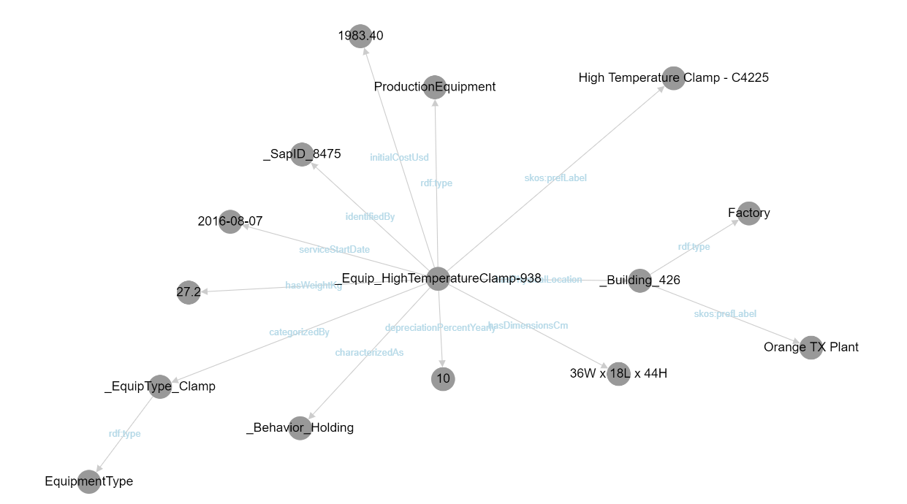
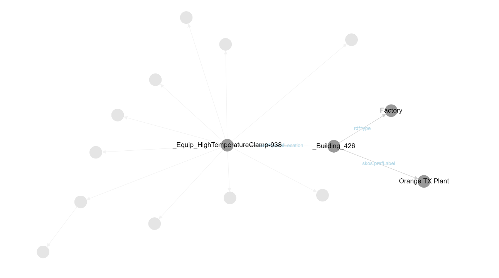

# markviz
A very simple RDF Turtle File Visularizer

## Setup

Requires python, and rdflib.

E.g.:

    pip install rdflib

On windows, copy both the markviz.bat and markviz.py to some directory in your PATH

# Running

## On windows

if you run the `markviz.bat` file, it will:

1. run the the python program (which creates an output file called `markviz.htm`
2. launch your default browser on that file.

Note that the generated HTML file, when launched, will go on the web to use the cytoscape javascript library.

E.g., to run on the demo file provided:

    markviz demo.ttl

## From Python

Just run

    python markviz.py demo.ttl > out.htm

and then view `out.htm` in your browser

# Screen shots

- All nodes shown - default on startup

---

- Touch/click a node and its immediate connections only are shown

- Try dragging things around!

